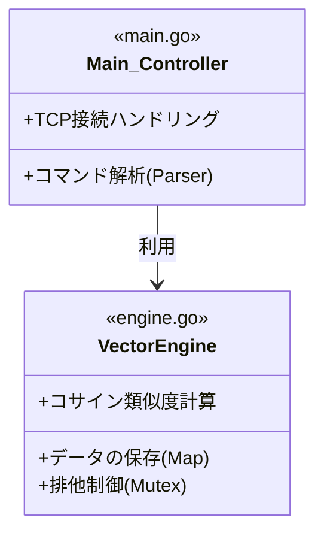

# Simple Vector Search Engine in Go 🚀

Go言語の標準ライブラリのみで実装した、学習用のインメモリ・ベクトル検索エンジンです。
TCPソケット通信を通じて、Redisのようなコマンドラインインターフェースで操作できます。

## 概要
RAG（Retrieval-Augmented Generation）の中核技術である「ベクトル検索」の仕組みを深く理解するために、**コサイン類似度計算をゼロからGo言語で実装**しました。
ブラックボックスになりがちな「AIが似ている文章を探す仕組み（高次元ベクトルの内積計算）」を、自分の手で再現・検証するためのプロジェクトです。

## 🏗 アーキテクチャ

関心の分離（Separation of Concerns）を意識し、通信層と計算ロジック層を明確に分けて設計しました。



## 🛠 技術的なこだわり

1.  **完全な自作アルゴリズム**
    * 外部の数値計算ライブラリに頼らず、コサイン類似度（Cosine Similarity）の計算式を自力で実装し、数学的な理解を深めました。
2.  **標準ライブラリのみ (No Dependencies)**
    * `net`, `sync`, `bufio`, `fmt` などのGo標準ライブラリだけで構築しており、軽量でポータブルです。
3.  **並行処理とスレッドセーフ**
    * `sync.RWMutex` を採用し、**「検索（Read）は並列で高速に、追加（Write）は安全に」** 行える設計にしました。
4.  **リファクタリングと保守性**
    * TCP通信の処理とビジネスロジックを分離し、コマンド処理を関数化することで、将来的な機能拡張（DELETEコマンド等の追加）を容易にしています。

## 🚀 使い方 (Quick Start)

### 1. サーバーの起動
```bash
# リポジトリ内の全Goファイルを実行
go run .
```

### 2. クライアントからの接続
別のターミナルを開き、TCPで接続します。
```bash
nc localhost 8080
# Windowsの場合は: telnet localhost 8080
```

### 3. コマンドの実行例
**データの登録 (ADD)**
`ADD <ID> <ベクトルデータ...>`
```text
ADD color_red   1.0 0.0 0.0
ADD color_blue  0.0 0.0 1.0
ADD color_mix   0.5 0.0 0.5
```

**類似ベクトルの検索 (SEARCH)**
`SEARCH <クエリベクトル...>`
```text
# 「赤紫」っぽい色で検索してみる
SEARCH 0.8 0.0 0.2
```

**実行結果**
スコア（類似度）が高い順に上位3件が表示されます。
```text
ID: color_red, Score: 0.9701
ID: color_mix, Score: 0.8437
ID: color_blue, Score: 0.2425
```

## 📂 ファイル構成
* **`main.go`**: TCPサーバーの立ち上げ、クライアント接続の受付、テキストコマンドのパース（解析）を担当。
* **`engine.go`**: ベクトルデータの保存、コサイン類似度の計算、検索ロジックを担当。

## 🔮 今後の展望
* OpenAI API等と連携し、実際のテキストデータをEmbeddingして検索できるようにする。
* データ量が増えた際に、Goroutineを使った並列計算で検索速度を維持する。
* データの永続化（ファイルへの保存/読み込み）の実装。